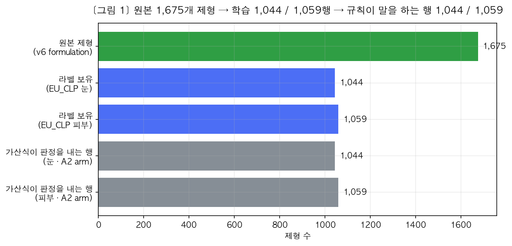
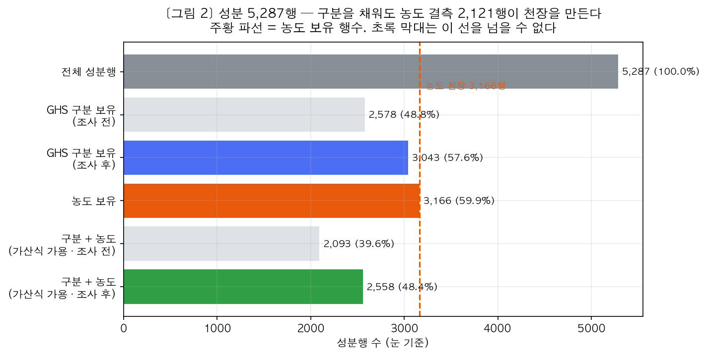
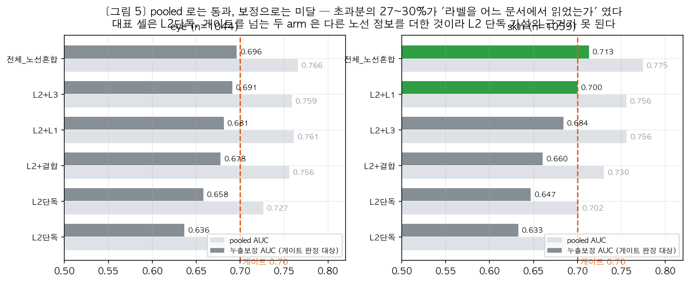
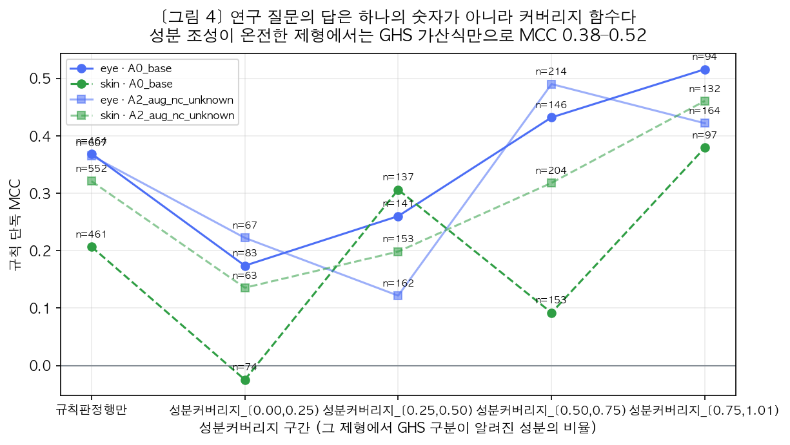
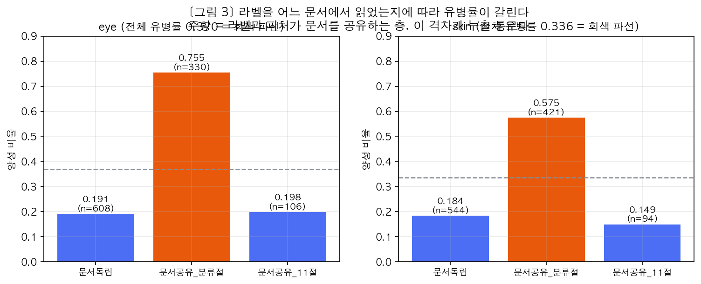

# 신작물보호제 제형 GHS 분류 — 모델·데이터 현황

문서 정보 | 작성일 2026-09-14 | 작성 한서윤

① 데이터 현황 ② 모델 개발 현황 ③ 데이터 검토 결과 ④ 남은 결정

## 1. 데이터 현황

### 1-1. 무엇을 만드는가

**1. 노선 분리**
팀원 3명이 같은 제형을 다른 입력 문서로 나눠 맡음. 1번 = 완제품 SDS 선언값, 3번 = 성분 SMILES 구조, 제가 맡은 2번 = 성분별 MSDS 위험정보 × 농도 + 혼합물 조성.
성능 경쟁이 아니라 질문이 다름. **성분 정보와 GHS 혼합물 분류 규칙만으로 완제품 GHS 분류를 어디까지 되짚을 수 있는가.**

**2. 산출물**
제형 단위 눈(eye)·피부(skin) 2개 모델. 감작은 학습 라벨로 쓰지 않고 기록만 보존.

**3. 관할**
EU CLP. 관할은 스위치 2개로 정의 — 눈 구분 2B 를 분류로 보는가 / 피부 구분 3 을 분류로 보는가. EU CLP 는 둘 다 X.

### 1-2. 규모

**1. 전체**
제형 1,675개 · 성분행 5,287개 · 제형당 성분 평균 3.16개.

**2. 학습에 들어가는 범위**
EU CLP 라벨 보유행만 남기면 눈 1,044행 / 피부 1,059행. 양성 비율 눈 0.370 / 피부 0.336.
한 번 더 줄어드는 자리가 있음. GHS 가산식(UN GHS 3.3 혼합물 가산성)이 실제로 판정을 내는 행은 눈 607 / 피부 552. 나머지는 성분 정보가 모자라 규칙이 아무 말도 하지 X.

*그림 1. 원본 1,675개 제형에서 규칙이 판정을 내는 행까지*

**3. 평가 방식**
5개 시드 × 5폴드 교차검증. 제형 그룹을 폴드에 걸치지 않게 묶음.

### 1-3. 병목은 GHS 구분이 X, 농도

**1. 구분은 채웠음**
성분 GHS 구분 결측이 문제라고 보고 CLP Annex VI · ECHA C&L 에서 455종 조사·반영. 눈 구분 보유 성분행 2,578 → 3,043.

**2. 그런데 성능이 안 움직임**
이유는 농도. 가산식은 **구분과 농도를 둘 다** 받아야 계산. 농도 보유 성분행은 5,287행 중 3,166행(59.9%)뿐. 구분을 아무리 채워도 가산식에 들어가는 행은 이 3,166행 안쪽이고, 구분+농도가 함께 있는 행은 조사 후에도 2,558행(48.4%).

*그림 2. 구분을 465행 채워도 농도 보유 행수(주황 파선)가 천장을 만든다*

→ 다음 데이터 확보는 새 성분 목록이 X, **이미 있는 성분의 농도**.

**주의:** 농도·pH 결측에 값을 만들어 넣지 않았음. 결측을 0 이나 7 로 채우면 그 행이 조용히 '무해' 로 분류됨. 결측은 결측으로 유지.

## 2. 모델 개발 현황

### 2-1. 지금 어디까지

제형 눈·피부 2개 모델 구동·성능 측정 완료. 성분 GHS 조사·검수 완료. 게이트(ROC-AUC 0.70) 미달.

측정 규약 3개를 못 박아 둠.

- **임계값 τ 는 폴드마다 따로** 구해 그 폴드 검증행에만 적용. τ 를 평균해 쓰면 라벨이 새어 들어옴.
- **AUC 는 pooled 와 누출보정 둘을 항상 병기.** pooled 단독 인용은 규약 위반.
- **게이트 판정은 보정 AUC 로.**

### 2-2. 성능 — pooled 통과, 보정 미달

대표 셀(L2단독, 특성 42열).

| | 눈 | 피부 |
|---|---|---|
| pooled AUC | 0.7265 | 0.7015 |
| 누출보정 AUC | 0.6580 | 0.6470 |
| MCC | 0.342 | 0.280 |
| BA | 0.674 | 0.647 |
| 게이트 0.70 | 미달 | 미달 |

*표 1. L2단독 대표 셀 성능*

pooled 0.7265 는 통과처럼 보임. 보정하면 0.6580. 그 차이의 정체 — **초과분의 27~30%가 '라벨을 어느 문서에서 읽었는가'** 였음. 모델이 성분 조성을 보고 맞힌 게 X, 라벨과 특성이 문서를 공유하는 행을 알아본 것.

*그림 3. 회색 = pooled, 초록/진회색 = 누출보정. 게이트는 보정으로 판정*

cf. 게이트를 넘은 arm 2개 — 피부 전체_노선혼합 0.7130, 피부 L2+L1 0.7000. 둘 다 **다른 팀원 노선의 정보를 더한 것**이라 제 가설의 근거로는 쓸 수 X.

### 2-3. 답은 숫자 하나가 X, 커버리지 함수

"규칙만으로 얼마나 재현되는가" 에 전체 MCC 하나로 답하면 틀림. 성분 정보가 부족한 제형이 평균을 끌어내려 규칙 자체가 별로라는 오독이 남음 — 제형별로 성분 정보의 온전함이 다르고 성능이 그 비율에 따라 갈림.

성분 커버리지(그 제형에 든 성분 중 GHS 구분을 아는 성분의 비율. 예: 성분 4개 중 2개만 알면 0.50)로 구간을 나눈 규칙 단독 MCC.

| 성분 커버리지 | 눈 MCC | 피부 MCC |
|---|---|---|
| 0.00–0.25 | 0.174 | −0.025 |
| 0.25–0.50 | 0.260 | 0.306 |
| 0.50–0.75 | 0.432 | 0.092 |
| 0.75–1.00 | **0.516** | **0.379** |

*표 2. 성분 커버리지 구간별 규칙 단독 MCC*

커버리지 0~25%(정보 거의 X)는 눈 0.174 · 피부 −0.025 로 찍기 수준이고 피부는 찍기보다도 못함. 커버리지 75~100%(정보 거의 다 있음)는 눈 **0.516** · 피부 **0.379** 로 규칙만으로도 상당히 잘 맞힘.

*그림 4. 성분 조성이 온전한 제형에서는 가산식만으로 MCC 0.38–0.52*

→ 결론은 "규칙으로 안 된다" 가 X, **"조성이 온전하면 규칙만으로도 상당히 된다"**. 못 하는 것은 규칙이 X, 데이터.

### 2-4. 성분 GHS 값 추가 반영 — 효과 없음

**1. 대조 방법**
조사값 465/493행 반영 후 5개 arm 을 대응차(paired) 밴드로 견줌. 같은 시드 5개로 돌았으니 시드별 값이 강하게 상관. 각 arm 의 SD 를 밴드로 쓰면 공통 변동을 두 번 세어 모든 대조가 '잡음' 으로 나오므로, 같은 시드끼리 뺀 차이의 SD 를 씀.

**2. 판정 표현**
이 밴드는 **교차검증과 랜덤포레스트의 재현 잡음**만 재고 표본 자체의 불확실성은 재지 X. 그래서 '유의한 개선' 이 아니라 `시드 재현 범위 밖/안` 으로 적음. 시드 5개(자유도 4) SD 의 상대오차가 40% 가까워서, 같은 효과 크기가 밴드 안과 밖으로 갈리는 일이 실제로 있었음.

**3. 결과**
개선 쪽으로 밴드를 벗어난 대조 0건. 눈 보정 AUC 0.6580 → 0.6532, 피부 0.6470 → 0.6497 로 둘 다 범위 안. 벗어난 것은 눈 `조사후_NC유지` 손실 2건뿐(MCC −0.0200 ±0.0151, BA −0.0084 ±0.0069).

**4. A0(MSDS 칸) 채움 — 채택 X**
유해 구분만 옮기면 입력 행렬이 한 칸도 안 바뀜. 성능이 같은 게 X, 계산이 같음. A2 증강 경로가 A0 결측일 때 이미 그 값을 끌어다 쓰므로 A0 으로 옮기는 것은 정의상 무연산.
→ 이 실험은 'A0 이동의 효과가 0' 이 X, **A2 아래에서는 A0 이동을 측정할 수 X**. 우연한 일치와 반영 실수를 코드가 구별하도록 두 행렬 동일성을 assert 로 박아 둠.
남는 차이는 전부 `NC` 몫이라는 뜻. 그리고 NC 까지 살려 넣으면 손실(눈 보정 AUC −0.0080, 피부 MCC −0.0161). A0 채움 채택 X.

## 3. 데이터 검토 결과

### 3-1. 라벨 출처 층에 따라 유병률이 갈림

라벨 출처를 3개 층으로 나눔.

| 층 | 눈 n / 유병률 | 피부 n / 유병률 |
|---|---|---|
| 문서독립 | 608 / 0.191 | 544 / 0.184 |
| 문서공유_분류절 | 330 / 0.755 | 421 / 0.575 |
| 문서공유_11절 | 106 / 0.198 | 94 / 0.149 |

*표 3. 라벨 출처 층별 표본 수와 유병률*

문서공유_분류절 층의 유병률은 눈 0.755 로 전체 0.370 의 두 배가 넘음. 라벨과 특성이 같은 문서에서 나온 층이라 모델이 층만 알아봐도 점수가 오름. 이게 누출 통로.

*그림 5. 주황 = 라벨과 특성이 문서를 공유하는 층*

그래서 보정 AUC 를 층 안에서 계산한 뒤 일치쌍으로 가중. 층을 가로지르는 이득은 여기서 안 잡힘.

### 3-2. 검수에서 나온 것

손으로 확인하지 않고 Critic 에이전트와 전용 검수 스크립트로 돌림. 어떤 값도 고치지 않고 목록만 산출.

**1. MSDS 선언값 자체는 깨끗**
규제 DB 와 대조한 눈 99종 중 96종(97.0%)이 심각도까지 일치. 피부는 104종 중 103종(99.0%). CLP Annex VI 조화분류보다 낮게 선언된 것은 눈 1종(2-페닐페놀)뿐.
심각도 비교에 규칙 하나를 명시해 둠. 맨 `1` 은 `1A/1B/1C` 중 어느 것인지 **말하지 않는 표기**(Annex VI 의 H314 가 하위구분을 구별하지 못함). 그래서 MSDS 가 `1B` 로 더 구체적인 것은 과소선언에서 빼고 `구분granularity차이` 로 따로 셈 — 눈 1종 · 피부 1종(아세트산 MSDS `1B` vs 규제 `1`). `1A` vs `1B` 처럼 둘 다 명시된 쌍은 이 규칙에 안 걸리므로 진짜 과소선언은 그대로 잡힘.

**2. 같은 물질이 제형마다 다르게 선언된 사례 X**
표기가 갈리는 물질이 피부에 2종 있는데 하나는 위의 하위구분 미지정 차이, 나머지도 심각도는 같음. 문서 추출 잡음이 걱정보다 작았음.

**3. 대조 범위가 좁음**
MSDS 값을 가진 눈 172종 중 99종(57.6%)만 대조. 미대조 73종을 갈라 보면 44종은 **대조 표본 자체에 안 들어간 것**(상위 400종 컷)이고 실제 DB 미등재는 29종(UVCB·석유유분 등). 표본 안 커버리지 77.3%. 위 일치율은 이 범위 안의 숫자.

**4. 독립조사 칸에 결함**
`ing_ghs_indep_*` 칸에서 tier 가 `annex_vi` 인데 구분이 `NC` 인 행이 눈 892/1,144(78%) · 피부 1,069/1,248(86%). 같은 칸의 `echa_cl` tier 에는 그런 행이 0건. Annex VI 는 **부분 조화 목록**이라 등재가 없다는 게 무해를 뜻하지 X. 이 비대칭은 **부재를 NC 로 읽었다**는 서명.
→ 영향 범위 두 곳. 조사 정확도 산정은 이 층을 이미 '순환 대조' 로 표시해 빼 두었으므로 영향 X. 실질 영향은 ① `annex_vi` 표기만 골라 채운 arm — 보정 AUC +0.0097 로 유일하게 개선처럼 보였는데 그 채움의 대부분(777/1,067행)이 이 무효 행 ② 이 칸의 `NC` 를 '조화분류가 확정한 무해' 로 인용하는 모든 자리. **개선으로 읽으면 안 됨.**

**5. 막지 못한 것 하나**
`lib_model.ct_predict` 가 농도 결측을 `None` 만 걸러내고 `NaN` 은 통과시킴. 그래서 농도가 없는 행에 구분을 넣으면 가산합 전체가 `NaN` 이 되고 판정이 조용히 NC 로 내려감. 지금 눈 73 · 피부 45개 성분행이 이 상태이고, 제형 눈 23 · 피부 16개(1,675 중 1.2%)가 그 때문에 NC. `lib_model.py` 는 버전 고정이라 조사 반영 쪽에서 막았음.

## 4. 남은 결정

할 것 (우선순위 순)

**1. `_tier` 와 `_tier_src` 중 어느 쪽이 정본인가**
v6 에 두 칸이 다른 값으로 들어 있고 읽는 쪽도 다름(A0 채움은 `_tier`, A3_strict arm 은 `_tier_src`).

**2. 눈 구분 `2A` 를 `2` 로 합칠지**
조사가 새로 만든 `2A` 가 기존 어휘 {NC, 2, 1} 과 다름. 맨 `2` 는 관할 스위치(2B 를 분류로 보는가)가 적용되지 X.

**3. `ph_best` 를 어느 노선에 귀속시킬지**

**4. `L2L3결합` 28열의 최종 귀속**

**5. 배포본 재전달 여부**
팀원에게 보낸 규약 묶음이 감작 9열 → 7열 정정 이전 판.

→ 다음 작업은 새 특성이 X, **농도 결측 2,121행**. 그림 2 와 그림 4 를 겹쳐 보면 여기에만 여유가 남아 있음.
